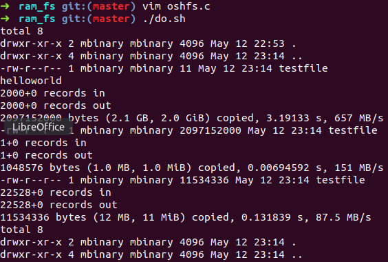

# Simple Filesystem
> An implementation of userspace filesystem using fuse interfaces

## Function
* view attr of files and the root directory
* read file
* write file

## Design

## Vision

## LICENCE
[MIT](LICENCE)
