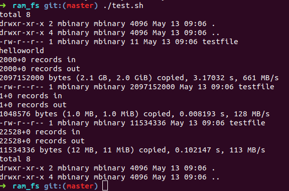

# Simple Filesystem
> A simple file system running on user space

## Function
- [x] read file
- [x] write file
- [x] truncate file
- [x] ls: view attrs 
- [x] chown, chmod
- [ ] directory operations ( to do )
## Design
### metadata of fs
* TOTAL SIZE: 4G
* BLOCKSIZE: 4KB
* BLOCKNR  : 4G/4KB
* NAME_LENGTH: 256
* block_no_t: int  (the type of block_no)
* Each block has a block_no at the begining 
### super block
```c
struct super_node
{
    block_no_t block_no;
    block_no_t used_block;
    block_no_t last_block;
    block_no_t blocknr;
    unsigned  namelen;
    unsigned  blocksize;
    struct entry_node * next;
};
```

block 0( aka mem[0]) is the super block.

It stores the num of used_blocks and the num of the latest used block.

The latest used block is exactly the head block of the node-chain 

### entry_node 
metadata of each entry( dir or file) stored in mem blocks 
including : 
* int block_no  : num of mem block
* int content   : is the value of the first mem block_no of the files's content( for dir, it's -1)
* stat st       : st of each entry
* filenode\* next: next node
* char name[256]: entry name 


### data_node
At the begining, this node stores block_no
The following are file data content


### Free space allocation algorithm 
`next fit`

## Resource
- [binary file](src/oshfs)
- [test file](src/test.sh)

## Vision


## Licence
[MIT](LICENSE)
